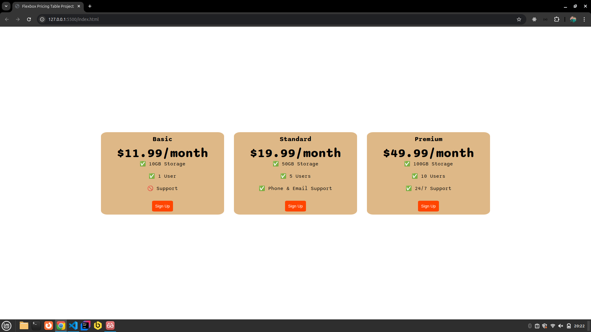

<h1 align="center"> Pricing Table Project</h1>

Hands on project to fix the contents and concepts of the bootcamp, focus on CSS Display.  

  <a href="#-techs">Techs</a>&nbsp;&nbsp;&nbsp;|&nbsp;&nbsp;&nbsp;
  <a href="#-project">Project</a>&nbsp;&nbsp;&nbsp;|&nbsp;&nbsp;&nbsp;
  <a href="#-learning">Learning</a>&nbsp;&nbsp;&nbsp;|&nbsp;&nbsp;&nbsp;
  <a href="#-license">License</a>

  

 

  

## 🚀 Techs

This project was developed using:

- HTML
- CSS
- Git

## 💻 Project

Pricing Table Web Page, simulate a monthly plan.

## 📑 Learning

During the developmet of this web page I fix the Display concept of CSS.

## 📝 License

Project is under MIT License.

---